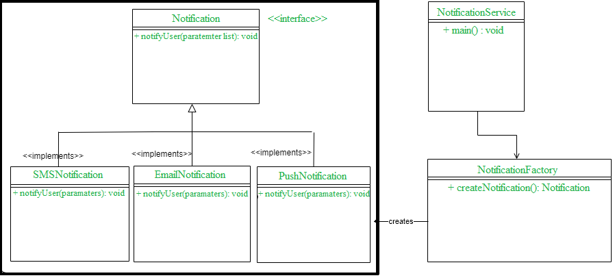

# Factory Design Pattern

Factory is a creational design pattern which is used to create different 
implementation objects at runtime.

Factory Design Pattern says define an interface and let the sub classes decide which object to instantiate.

